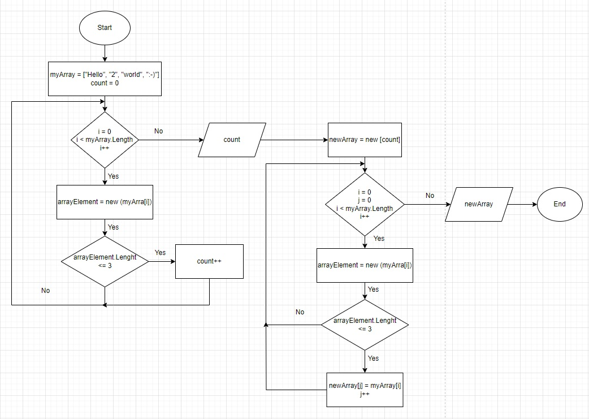

# Итоговая контрольная работа по основному блоку

### Задача 1. Создать репозиторий на GitHub

1. Создаем учетную запись на GitHub и авторизуемся.
2. Заходим в Repositories и с помощью button New создаем новый репозиторий.
3. Ссылка репозитория на [GitHub](https://github.com/DenNikiten/FinalControlWorkOnTheMainBlock)

### Задача 2. Нарисовать блок-схему алгоритма

1. Воспользуемся сайтом [draw.io](https://www.drawio.com/)
2. Нарисуем блок-схему алгоритма с помощью *drawio*
3. Блок-схема алгоритма: *DiagramFCWontheMB.drawio*
4. Блок-схема алгоритма в тексте: 

### Задача 3. Снабдить репозиторий оформленным текстовым описанием решения

**Запишем текстовое описание решения в MarkDown**:

***Для решения задачи используем три метода:***
1. __CountArray__ - интовый метод, подсчитывающий количество элементов массива, длина которых меньше, либо равна 3 символам. Для подсчета используем счетчик count, цикл for, в котором каждый элемент массива представляем как строку и с помощью условия if подсчитываем число  элементов, удовлетворяющих условию, а затем возвращаем количество элементов массива - *count*;
2. __CreateNewArray__ - строковый метод, возвращающий новый массив элементов *newArray*.
В предыдущем методе __CountArray__ мы подсчитали количество элементов массива, длина которых меньше, либо равна 3 символам - *count*. *count* необходим для определения  размера нового массива *newArray*. Создадим новый массив *newArray* с размером *count*. Воспользуемся циклом for, в котором каждый элемент массива представляем как строку и с помощью условия if подсчитываем число  элементов, удовлетворяющих условию. При удовлетворении условия if, присваеваем элементу нового массива значение элемента старого массива и при этом увеличиваем на единицу индекс для нового элемента массива, если такой имеется. Когда цикл завершится, возвращаем новый массив *newArray*.
3. __ShowArray__ - войдовский метод, который выводит для наглядности элементы нашего нового массива *newArray*.

### Задача 4. Написать программу, решающую поставленную задачу

// int CountArray(string[] array)
// {
//     int count = 0;
//     for (int i = 0; i < array.Length; i++)
//     {
//         string arrayElement = new string(array[i]);

//         if(arrayElement.Length <= 3)
//             count++;
//     }
//     return count;
// }

// string[] CreateNewArray(string[] array, int count)
// {    
//     string[] newArray = new string[count];

//     for (int i = 0, j = 0; i < array.Length; i++)
//     {
//         string arrayElement = new string(array[i]);    
//         
//         if (arrayElement.Length <= 3)
//         {
//             newArray[j] = array[i];
//             j++;
//         }
//     }
//     return newArray;
// }

// void ShowArray(string[] array)
// {
//     for(int i = 0; i < array.Length; i++)
//     {
//         Console.Write(array[i] + " ");
//     }
//     Console.WriteLine(); 
// }

// string[] myArray = {"Hello", "2", "world", ":-)"};

// int numberElementsArray = CountArray(myArray);

// string[] result = CreateNewArray(myArray, numberElementsArray);
// ShowArray(result);
